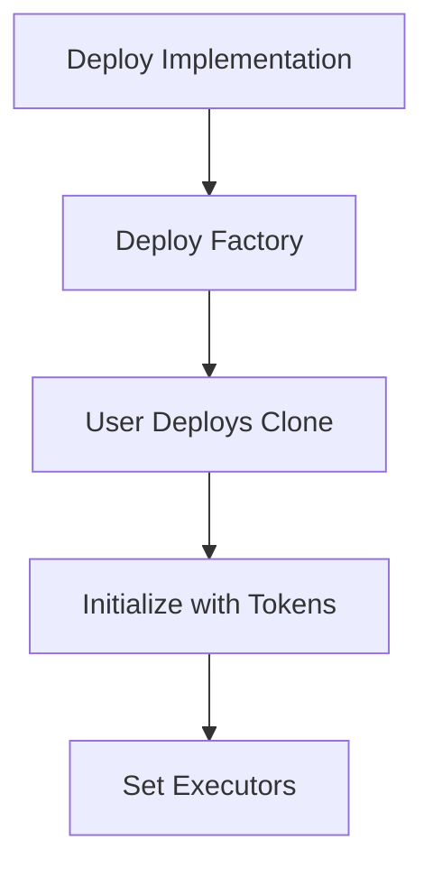
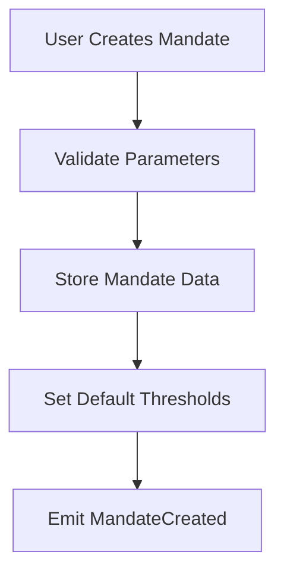
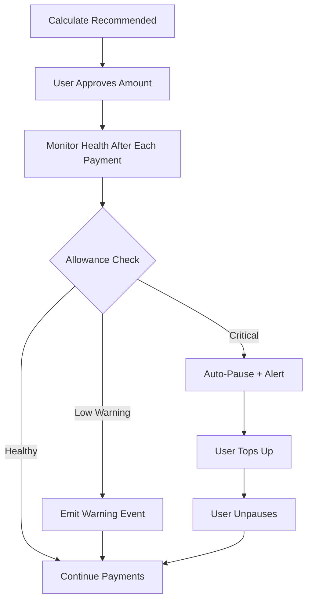
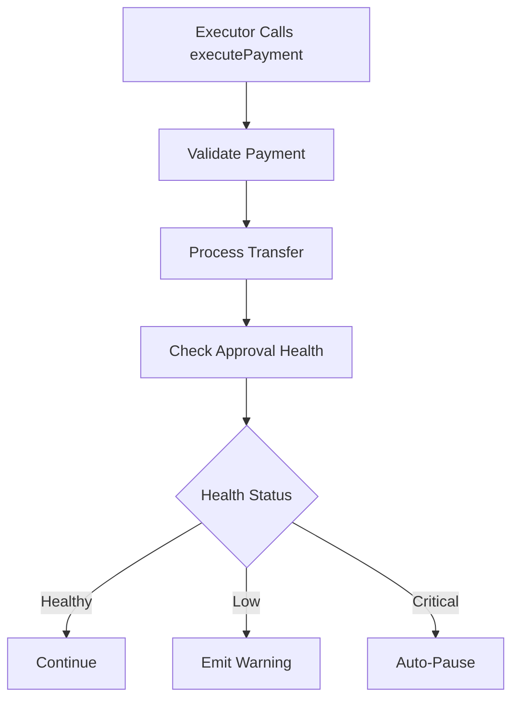

# Debyth Mandate Contract Flow

## Overview
The Debyth Mandate system enables automated recurring stablecoin payments with intelligent approval management. Users maintain full control while the system provides automation and proactive monitoring.

## Core Architecture

### Contract Structure
```
Mandate.sol (Main Contract)
├── MandateData struct - Core mandate information
├── ApprovalSettings struct - Approval health configuration
├── Clone-based deployment - Gas-efficient scaling
└── Role-based access control - Security & permissions
```

### Key Design Decisions

#### 1. **Clone Pattern vs Upgradeable Proxies**
- **Why Clones**: Lower gas costs, simpler deployment, no upgrade complexity
- **Trade-off**: Each user gets their own contract instance
- **Benefit**: Complete isolation, no shared state risks

#### 2. **Separated Struct Design**
- **Problem**: "Stack too deep" compilation errors with large structs
- **Solution**: Split `MandateData` and `ApprovalSettings` into separate mappings
- **Benefit**: Cleaner code, better gas optimization, modular design

#### 3. **Intelligent Approval Management**
- **Problem**: Users don't want infinite approvals but hate failed payments
- **Solution**: Automated monitoring with predictive alerts
- **Features**:
  - Health monitoring after each payment
  - Configurable warning thresholds
  - Auto-pause on critical low allowance
  - Smart top-up recommendations

## Complete User Flow

### Phase 1: Setup & Initialization



1. **Implementation Deployment**
   ```solidity
   Mandate implementation = new Mandate();
   ```

2. **Factory Deployment**
   ```solidity
   MandateFactory factory = new MandateFactory(implementation);
   ```

3. **User Clone Creation**
   ```solidity
   address clone = factory.deployMandateContract([USDC, USDT]);
   ```

### Phase 2: Mandate Creation



**Parameters Validated:**
- Payee ≠ address(0) and ≠ payer
- Token is supported (USDC/USDT)
- Amounts > 0 and perPayment ≤ total
- Valid time ranges (start < end, start ≥ now)
- Frequency > 0

**Default Approval Settings:**
- Low threshold: 3 payments remaining
- Critical threshold: 1 payment remaining
- Auto-pause: Enabled

### Phase 3: Approval Strategy

#### Traditional Approach Problems:
- **Infinite Approval**: Security risk, user discomfort
- **Exact Approval**: Frequent re-approvals, poor UX
- **Manual Management**: Users forget, payments fail

#### Our Intelligent Solution:



**Calculation Logic:**
```solidity
function calculateRecommendedTopUp(uint256 mandateId, uint256 paymentsAhead) 
    returns (uint256) {
    uint256 baseAmount = paymentsAhead * perPaymentLimit;
    uint256 buffer = baseAmount / 10; // 10% buffer
    
    // Consider remaining mandate duration
    uint256 maxNeeded = remainingPayments * perPaymentLimit;
    uint256 remainingLimit = totalLimit - totalPaid;
    
    // Return minimum of calculated, max needed, and remaining limit
    return min(baseAmount + buffer, maxNeeded, remainingLimit);
}
```

### Phase 4: Payment Execution



**Validation Checks:**
1. Mandate exists and is active
2. Not system-paused
3. Within time bounds (start ≤ now ≤ end)
4. Frequency constraint satisfied
5. Amount within per-payment limit
6. Total limit not exceeded
7. Sufficient allowance and balance

**Health Monitoring:**
```solidity
function _checkApprovalHealth(uint256 mandateId) internal {
    uint256 paymentsRemaining = currentAllowance / perPaymentLimit;
    
    if (paymentsRemaining <= criticalThreshold && autoPauseEnabled) {
        // Auto-pause and emit critical alert
        isPausedBySystem = true;
        emit ApprovalCritical(...);
        emit MandateAutoPaused(...);
    } else if (paymentsRemaining <= lowAllowanceThreshold) {
        // Emit warning and top-up request
        emit ApprovalLowWarning(...);
        emit ApprovalTopUpRequested(...);
    }
}
```

### Phase 5: User Control & Recovery

#### Approval Management:
- **Monitor**: `getApprovalHealth()` shows current status
- **Configure**: `setApprovalThresholds()` customizes warning levels
- **Control**: `setAutoPause()` enables/disables auto-pause
- **Recover**: `unpauseMandate()` resumes after top-up

#### Emergency Controls:
- **Cancel**: `cancelMandate()` stops all future payments
- **Revoke**: Set token allowance to 0 (immediate stop)
- **Admin**: Emergency cancel by contract admin

## Event-Driven Architecture

### Core Events:
```solidity
event MandateCreated(...)     // New mandate setup
event PaymentExecuted(...)    // Successful payment
event MandateCanceled(...)    // User cancellation

// Approval Health Events
event ApprovalLowWarning(...)     // Warning threshold reached
event ApprovalCritical(...)       // Critical threshold reached
event MandateAutoPaused(...)      // System auto-pause
event ApprovalTopUpRequested(...) // Smart top-up suggestion
```

### Integration Benefits:
- **Frontend**: Real-time status updates
- **Backend**: Automated monitoring and alerts
- **Analytics**: Payment pattern analysis
- **User Notifications**: Proactive communication

## Security Model

### Access Control:
- **DEFAULT_ADMIN_ROLE**: Contract management, emergency functions
- **EXECUTOR_ROLE**: Payment execution only
- **User Control**: Mandate creation, cancellation, settings

### Safety Mechanisms:
- **Pausable**: Emergency stop for entire contract
- **Auto-pause**: Individual mandate protection
- **Validation**: Comprehensive input checking
- **Allowance Checks**: Real-time balance verification

### User Sovereignty:
- Users always control their funds
- Can revoke approvals instantly
- Can cancel mandates anytime
- Configure their own risk thresholds

## Gas Optimization

### Design Choices:
1. **Clones over Proxies**: ~90% gas savings on deployment
2. **Struct Separation**: Avoids "stack too deep" errors
3. **Function Splitting**: Reduces complexity and gas costs
4. **Event Batching**: Efficient monitoring integration
5. **Storage Optimization**: Packed structs, efficient mappings

### Typical Gas Costs:
- Deploy clone: ~100k gas
- Create mandate: ~150k gas
- Execute payment: ~80k gas
- Health check: ~20k gas (piggybacks on payment)

## Integration Patterns

### For DApps:
```solidity
// Monitor approval health
(uint256 allowance, uint256 remaining, uint256 recommended, bool healthy) = 
    mandate.getApprovalHealth(mandateId);

if (!healthy) {
    // Show top-up UI with recommended amount
    showTopUpDialog(recommended);
}
```

### For Backend Services:
```javascript
// Listen for health events
mandateContract.on("ApprovalLowWarning", (mandateId, remaining, recommended) => {
    // Send user notification
    notifyUser(mandateId, `${remaining} payments remaining. Top up with ${recommended} tokens.`);
});

mandateContract.on("MandateAutoPaused", (mandateId, reason) => {
    // Alert user of pause
    alertUser(mandateId, `Mandate paused: ${reason}`);
});
```

## Why This Design Works

### 1. **User Experience**
- Set once, works automatically
- Proactive notifications prevent failures
- Full control maintained at all times
- Clear understanding of approval needs

### 2. **Security**
- No infinite approvals required
- Predictable approval consumption
- Multiple safety mechanisms
- User can exit anytime

### 3. **Scalability**
- Clone pattern supports unlimited users
- Gas-efficient operations
- Event-driven monitoring
- Modular architecture

### 4. **Reliability**
- Comprehensive validation
- Predictive failure prevention
- Graceful degradation (pause vs fail)
- Recovery mechanisms

This design achieves the perfect balance of automation and control, providing users with a "set and forget" experience while maintaining complete sovereignty over their funds.